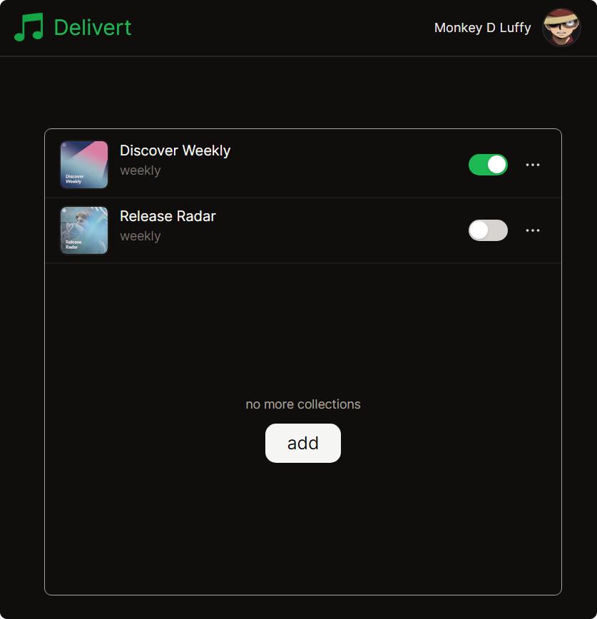

## What is this?

Spotify automatically compiles various playlists filled with track recommendations made specially for you. However, these playlists are updated at regular intervals (e.g. every day, week, or month), which means that you may miss out on a lot of good recommendations. This website helps you prevent this problem by auto-compiling selected playlists before they get updated.

## How do I use it?

Sign in [here](https://delivert.vercel.app), and then add the playlists you'd like to rescue to your **collections**. The default time interval is **weekly**, but you can reset it to be **daily** or **monthly**. The collection can be toggled on and off, or even deleted. By the way, you don't need to worry about duplicates: the same song is never added to the same collection twice!

